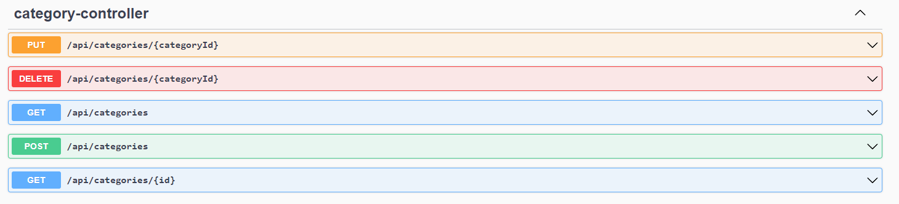

# API Spring Boot

##### Blog API Endpoints

##### Blog Comment API Endpoints

##### Blog Category API Endpoints

##### Features

- Authentication and Authorization with Spring Security
- Blog Service
- Category Service
- Comment Service
- Search & Query
- Eager Load & Lazy Load
- Each Service Include there own Crud functionality

##### Frameworks

- Spring Boot
- Spring Data JPA
- Spring Security
- Postgresql
- JWT
- Spring Doc
- Spring Validation
- Lombok

##### Patterns

- Dependency Injection
- DTO
